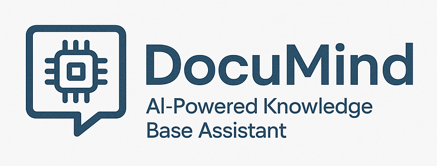

# 🧠 DocuMind - AI-Powered Knowledge Base Assistant




## ✅ **SYSTEM COMPLETED SUCCESSFULLY!**

The DocuMind AI-Powered Knowledge Base Assistant is now fully implemented and running at `http://localhost:8501`!

**NEW FEATURES**:
- 🔄 **Automatic Document Loading**: Documents in the `data/documents` folder are loaded automatically on startup
- 📄 **OCR Support**: Added OCR capabilities for problematic PDFs (like those saved from websites)
- 🔍 **PDF Diagnostics**: New utility to check and diagnose PDF processing issues

### 🎯 **What You Can Do Now:**

1. **📄 Add Documents** - Either place PDFs in the `data/documents` folder for auto-loading, or upload via the sidebar
2. **🔍 Ask Questions** - Query your documents in natural language
3. **🤖 Get AI Answers** - Receive contextual responses with source citations
4. **📊 Monitor Performance** - View analytics and evaluation metrics
5. **💬 Provide Feedback** - Help improve the system with your input

## 🌟 Key Features Implemented

- **📄 Multi-format PDF Processing**: Robust text extraction with fallback mechanisms and OCR support
- **📁 Automatic Document Loading**: Ability to auto-load PDFs from the documents directory
- **🔍 Hybrid Retrieval System**: Combines semantic similarity with keyword matching
- **🤖 Local AI Integration**: Uses Ollama (Llama 3.2 3B) for privacy-preserving responses
- **💬 Conversation Memory**: Maintains context across multiple questions
- **📊 Source Attribution**: Always shows which documents informed each answer
- **⚡ Real-time Evaluation**: Built-in quality metrics inspired by RAGAS
- **🎯 Adaptive Query Processing**: Routes different query types to specialized chains
- **📈 Analytics Dashboard**: Performance metrics and user feedback analysis
- **🔒 Privacy-First**: All processing happens locally - no external APIs

## 🚀 Technology Stack

- **Frontend**: Streamlit (Interactive web interface)
- **Document Processing**: PyPDF2, PyMuPDF, pdfplumber
- **Embeddings**: Sentence-Transformers (all-MiniLM-L6-v2)
- **Vector Database**: ChromaDB
- **LLM**: Ollama with Llama 3.2 3B
- **Evaluation**: Custom RAGAS-inspired framework
- **Feedback**: SQLite-based system

## Quick Start

1. **Install Dependencies**
   ```bash
   pip install -r requirements.txt
   ```

2. **Install OCR Dependencies (Optional)**
   ```bash
   pip install pytesseract pdf2image pillow
   brew install tesseract poppler  # For macOS
   # See OCR_SETUP.md for other operating systems
   ```

3. **Add Documents (Choose One)**
   - **Option A**: Place PDF files in the `data/documents` directory for auto-loading
   - **Option B**: Use the sidebar to upload PDF documents manually

4. **Run the Application**
   ```bash
   streamlit run app.py
   ```

5. **Start Querying**
   - Ask natural language questions about your documents
   - Get contextual answers with source citations

## Project Structure

```
DocuMind/
├── app.py                     # Main Streamlit application
├── check_pdf.py               # PDF diagnostic tool
├── OCR_SETUP.md               # OCR setup instructions
├── TEST_RESULTS.md            # Comprehensive test results
├── test_documind.py           # Main test suite
├── test_setup.py              # Setup verification tests
├── src/
│   ├── document_processor.py  # PDF processing and extraction with OCR
│   ├── chunking.py            # Semantic text chunking
│   ├── retriever.py           # Hybrid retrieval system
│   ├── llm_handler.py         # LLM integration and prompts
│   ├── evaluator.py           # Evaluation framework
│   └── utils.py               # Utility functions
├── data/
│   ├── documents/             # PDF documents for auto-loading
│   ├── vectorstore/           # Chroma vector database
│   └── feedback.db            # SQLite feedback database
├── config/
    └── settings.py            # Configuration settings
```

## Advanced Features

### 🔄 Auto-Loading Documents
- Documents placed in the `data/documents` directory are automatically loaded when the app starts
- Configure auto-loading behavior in `config/settings.py`:
  ```python
  AUTO_LOAD_DOCUMENTS = True  # Enable/disable auto-loading
  AUTO_LOAD_SKIP_EXISTING = True  # Skip already processed documents
  ```

### 📷 OCR Support for Problematic PDFs
- OCR (Optical Character Recognition) processing for difficult PDFs
- Automatically detects when a PDF needs OCR and applies it
- Perfect for PDFs saved from websites that have selectable text but don't parse correctly
- See `OCR_SETUP.md` for detailed setup instructions

### 🔍 PDF Diagnostic Tool
- Use `check_pdf.py` to diagnose problematic PDFs:
  ```bash
  python check_pdf.py path/to/document.pdf
  ```
- Identifies which extraction method works best for each document
- Determines if OCR processing is recommended

## Recent Fixes and Improvements

### 1. Enhanced Source Attribution 

Fixed an issue where some document sources were displayed as "Unknown" or with generic identifiers like "doc_41":

- Improved metadata extraction from documents
- Added better fallback handling for documents with missing metadata
- Enhanced document ID normalization for consistent display
- Added verification utility to check source metadata handling

To verify the fix is working correctly, run:
```bash
python verify_fixes.py --test metadata
```

### 2. Auto-Loading Improvements

Improved the auto-loading feature to better handle document metadata:

- Enhanced metadata extraction from auto-loaded documents
- Improved display of auto-loaded documents in the UI with dedicated icons
- Added verification utility to test auto-loading functionality

To verify auto-loading is working correctly, run:
```bash
python verify_fixes.py --test autoload
```

## Technology Stack

- **Document Processing**: PyPDF2, PyMuPDF, pdfplumber, Tesseract OCR
- **Embeddings**: Sentence-Transformers (all-MiniLM-L6-v2)
- **Vector Database**: ChromaDB
- **LLM**: Ollama (Llama 3.2 3B)
- **Frontend**: Streamlit
- **Evaluation**: RAGAS-inspired framework
- **Orchestration**: Custom pipeline architecture

## Testing & Troubleshooting

### Verify Setup
Run the test verification script to check if all components are properly set up:
```bash
python test_setup.py
```

### Run Comprehensive Tests
Run the full test suite to verify all components:
```bash
python test_documind.py
```

### Common Issues

1. **PDF Processing Issues**
   - For PDFs that don't parse correctly, try enabling OCR (see OCR_SETUP.md)
   - Use `check_pdf.py` to diagnose specific document issues

2. **Ollama Connection Issues**
   - Make sure Ollama is running: `ollama serve`
   - Verify model is installed: `ollama list`

3. **Vector Database Issues**
   - If experiencing issues with ChromaDB, try resetting: `python reset_chroma.py`

4. **Document Auto-Loading Not Working**
   - Check `config/settings.py` to ensure AUTO_LOAD_DOCUMENTS is set to True
   - Verify PDFs are in the correct location: `data/documents/`

5. **Source Display Issues**
   - If source documents are showing as "Unknown" or with generic IDs (like "doc_41")
   - Run the verification script: `python verify_fixes.py --test metadata`
   - Fix existing document metadata: `python fix_metadata.py --all`
   - If issues persist, clear the knowledge base and reload documents

See `TEST_RESULTS.md` for detailed information on system testing and performance.
